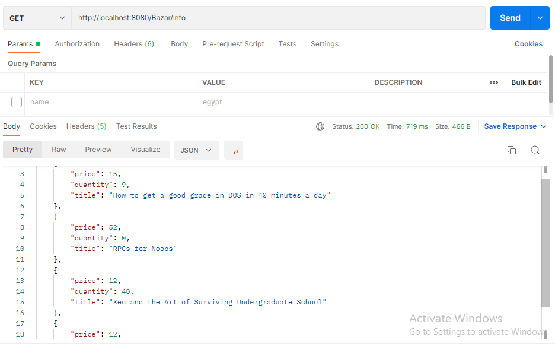
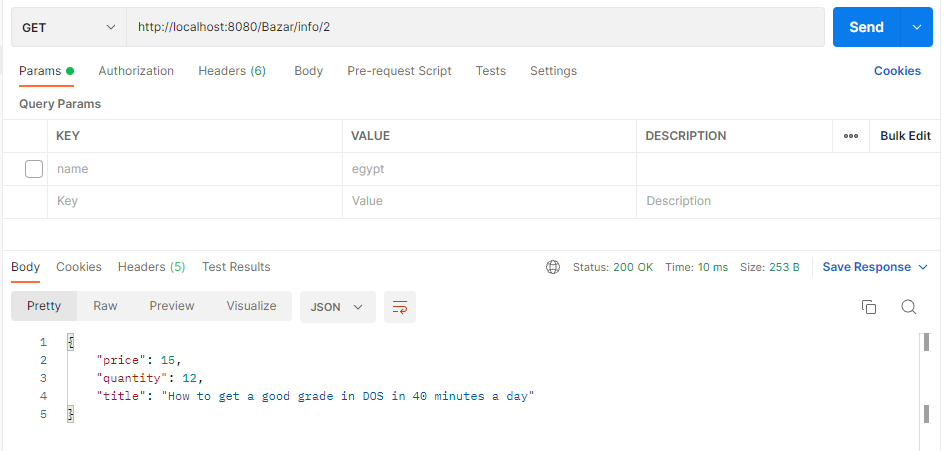
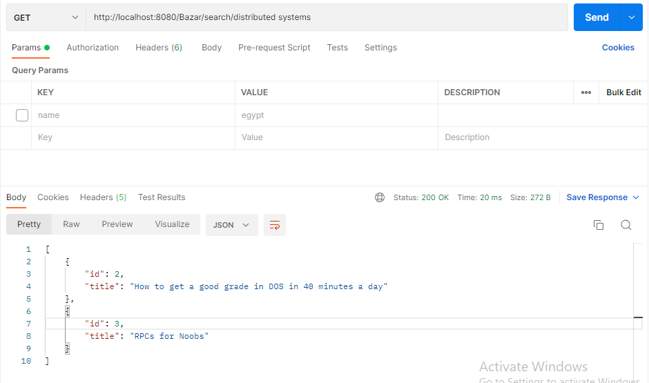
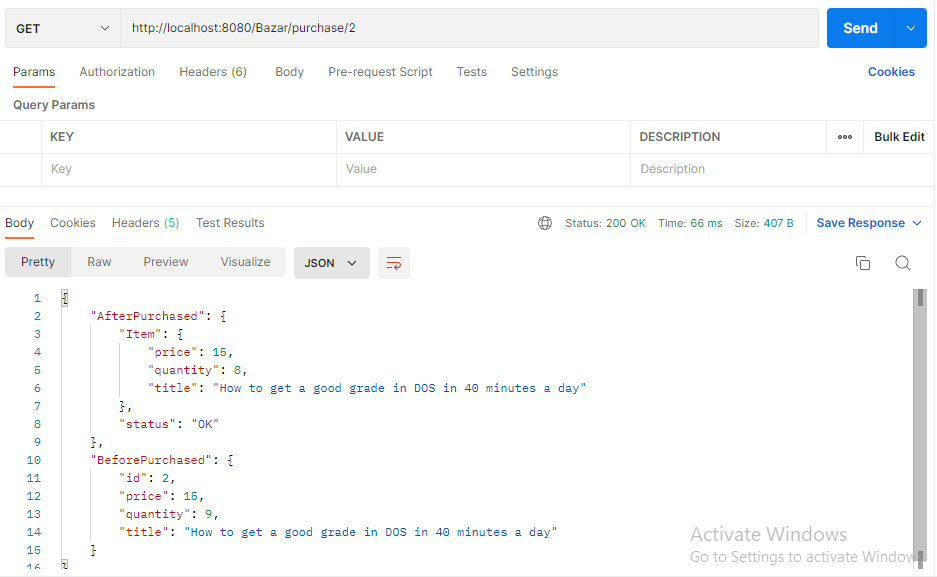

# DOS_Lab1_A_Multi-tier_Online_Book_Store
This project is about create a multi-tier online book store called Bazar.com

# How to run it?
- We used Docker to run it.
- Navigate to the project home directory using the terminal
- The docker client has Docker Compose included so using the terminal run the command

`docker-compose up`
- The five services should be running
- The Client-Service can be accessed on localhost:8080
- The catalog-Service1 can be accessed on localhost:8081
- The catalog-Service2 can be accessed on localhost:8083
- The orders-Service1 can be accessed on localhost:8082
- The orders-Service2 can be accessed on localhost:8084

## Orders Server Endpoints 
- To purchase a book use : `purchase/<id>` using GET methods

## Catalog Server Endpoints
- To get all items in the catalog : `info` using GET methods
- To get an item in the catalog : `info/<id>` using GET methods
- To get all items of a topic : `search/<topic>` using GET methods
- To decrease an item quantity by 1 : `update/<id>` using GET methods in clientservice but PUT from order to catalog

# How it works
We wrote the code in Python using FLASK
The design implemented consists of three separate components one for the Client side and two on the backend side,
namely the Client, Orders and Catalog servers. The main server is the Catalog which has the data on products,the orders server has the orders info and connects to the catalog to read and modify an item's info when an order comes.
We wrote a docker file which builds a docker image for each server to work separately independently, then we connected the images/dockerfile with a docker compose file that connects the containers.
There will be a two Database for catalog Service, one for each service.
To meet replication, cashing, Consistancy and load palancing. We do the following:
- For replicate data we make one replica for each catalog service.
- For cashing we defind an array to keep the request we got from the catalog which could be ger info for a book so we cahed it in the array.
- For load palancing we create a flage for each endpoint so that it togles the flag which swich from take request for egsample form the server CatalogSercice1 or CatalogSercice2.
- For Consistecy when we order a book to purchase it. We handle this request and we make the order server to update the two Databases to dicrease the quantite of the requested book.  
- For Consistecy when we order a book to purchase it.we delete(pop) book by id from cache

# Considerations and Possible Improvements
A GUI can be used with FrontEnd server

# Output Screenshots
screenshots showing the output of each operation on the clientservice server using Postman

## /info

## /info/id

  

## /search/topic

  

## /purchase/id

  
